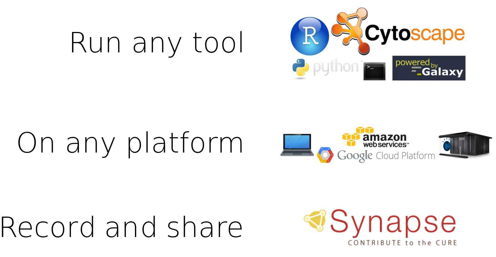
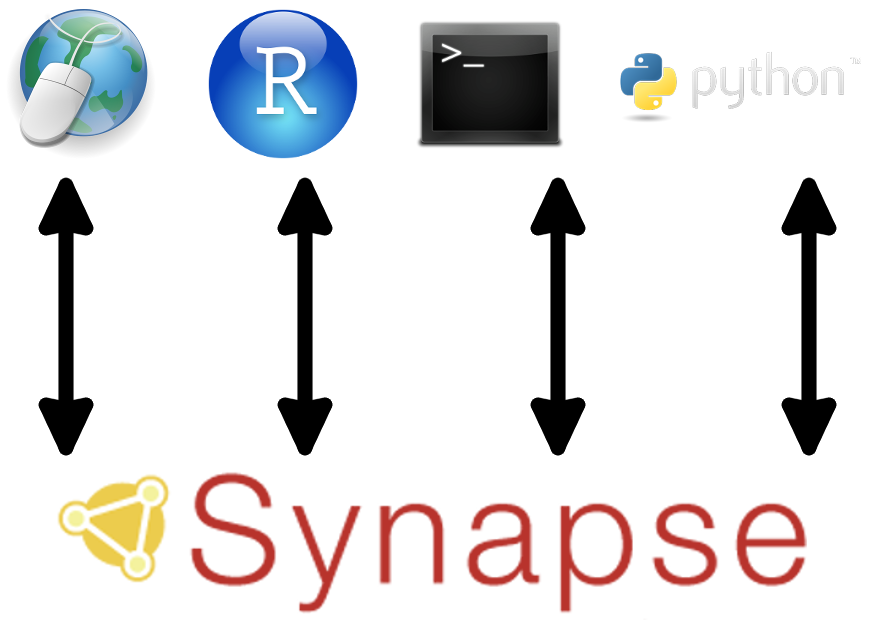
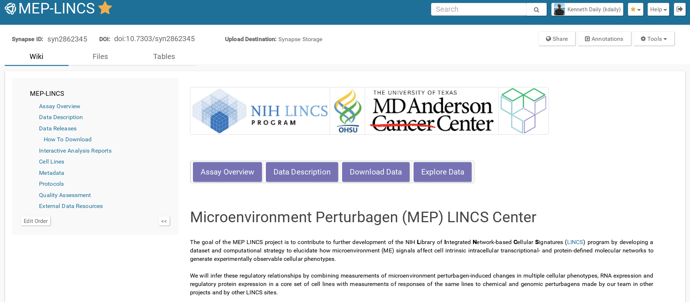
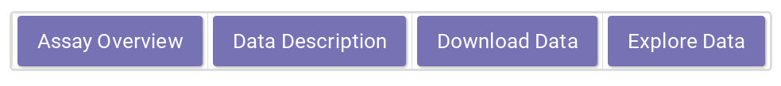
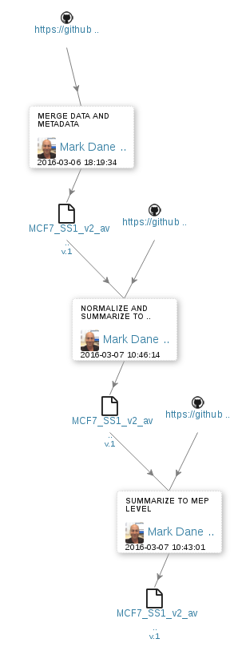
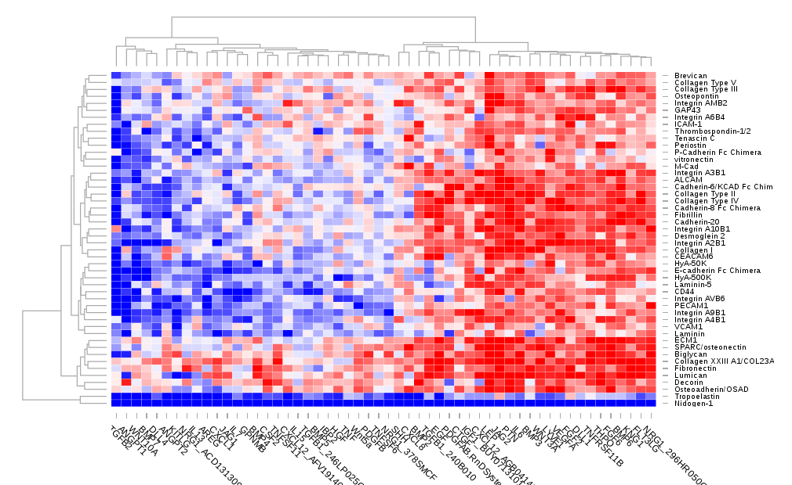
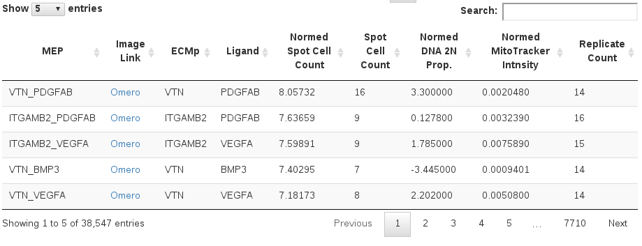
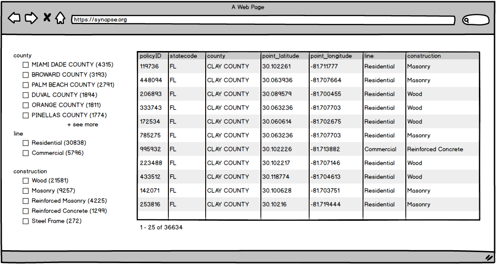

```{r loadlibs, echo=FALSE, warning=FALSE, message=FALSE, error=FALSE, eval=TRUE}
library(knitr)
library(dplyr)
library(xtable)
library(synapseClient)

# control what is output when knitting
# These can be overridden in specific chunks
knitr::opts_chunk$set(
  echo=FALSE,
  warning=FALSE,
  message=FALSE,
  error = FALSE,
  tidy = FALSE)
```

```{r eval=FALSE}
synapseLogin()
```

# Sage Bionetworks and Synapse

---


<br/>

* A workspace that allows you to **aggregate**, **describe**, and **share** research
* A tool to improve **reproducibility** of data intensive science, recording progress as you work
* A set of living research projects enabling contribution to large-scale collaborative solutions

<div class="notes">
Enabling researchers to contribute to large-scale collaborative science across institutions
</div>

---

<div class="centered">

</div>

## Multiple ways to access | Synapse API

<div class="centered">

</div>

# Where We Are

## MEP-LINCS Synapse Portal

<div class="centered">
https://www.synapse.org/mep_lincs



</div>

## Major reorganization of content | Created a narrative path for new users to follow



* [Education]() about MEP-LINCS
* Description of the [data generation]()
* Instructions on data [visualization]() and [download]()

Focused on the end-user who wants to see processed data and final results.

## Data Releases | We had one!

* First [data release](https://www.synapse.org/#!Synapse:syn2862345/wiki/394513)
* PC3, MCF7 and YAPC lines

```{r results='asis', eval=FALSE, include=TRUE}
res <- synTableQuery("SELECT Level,COUNT(Level) FROM syn5724840 GROUP BY Level")@values %>% 
  rename(`Number of files`=`COUNT(Level)`)
tab <- xtable(res)
print(tab, type="html", include.rownames=FALSE)
```

## Data Releases | First release details
<div class="columns-2">
* (Mostly) automated process for generating analyzed data, putting in Synapse
* Automated process for generating a [manifest table](https://www.synapse.org/#!Synapse:syn5724840) and the release page
* [Document and describe](https://www.synapse.org/#!Synapse:syn2862345/wiki/394651) how to get the data (possibly all of it)
* 100% of data files (levels 0-4, reports, QC) have annotations
* 100% of data files (levels 1-4, reports, QC) have provenance (including [code at github](https://github.com/MEP-LINCS/MEP_LINCS/)

<a href="https://www.synapse.org/#!Synapse:syn5706843"></a>
</div>

## Interactive data reports

* Users can view directly in Synapse and download for later use
* On a per cell line/staining set basis

<div class="centered">

</div>

## Interactive data visualization | Image files in Omero

<div class="centered">

</div>

[Example](https://meplincs.ohsu.edu/webclient/img_detail/412883/) from [syn5706712](https://www.synapse.org/#!Synapse:syn5706712)

# Looking Forward

## Portal
* Continue refinement of content
* 'Contextual' help for definitions
* Content for computational scientists
* More 'use case' examples for data access

## Annotations
* Continue the integration of LINCS-wide annotations 
* Use the existing system for capturing these and push to Synapse

## Data interaction
* The Standalone reports don't allow users to analyze across data sets
* Develop 'app' (Shiny) to facilitate this - but what questions to focus on?

## Protocols
* Protocol updates
* Connect to provenance where appropriate

## Next data release
* Streamline automation and testing before a release (completeness of annotations, provenance, release notes)
* Handling and communicating changes to current files

# New in Synapse

## Annotations

* Better management of annotations (required annotations)
* Faceted search to improve finding data

<div class="centered">

</div>

## Documentation

* New Synapse-specific help documentation

<div class='centered'>
http://docs.synapse.org/
</div>


## Thank you! | Questions?

* [MEP-LINCS](http://www.lincsproject.org/centers/data-and-signature-generating-centers/oregon-u/) Group
* [Sage Bionetworks](http://sagebase.org/)
